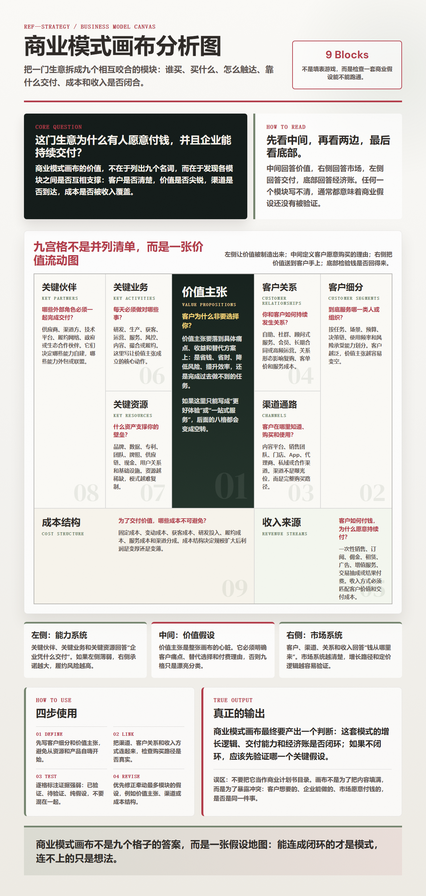
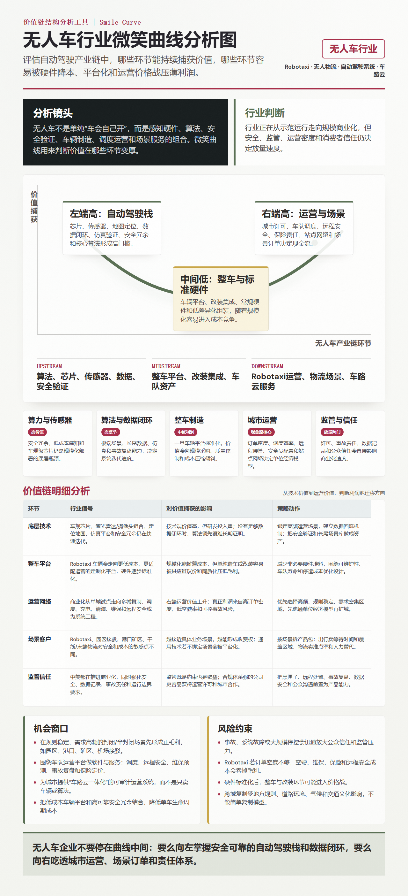
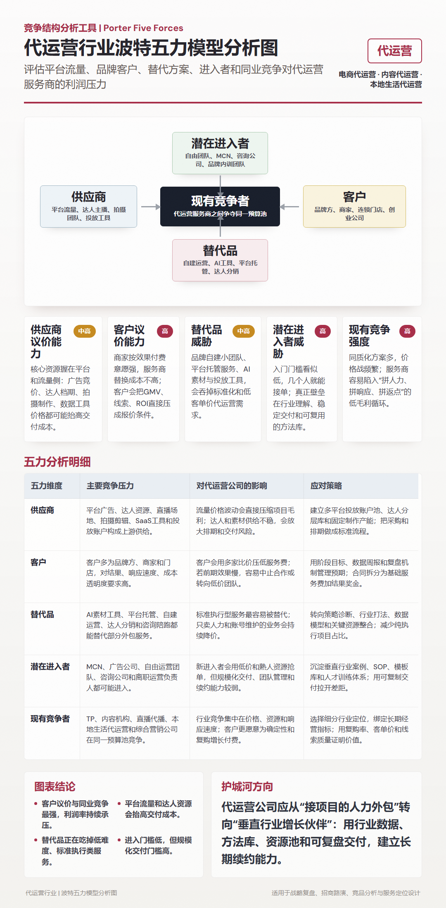
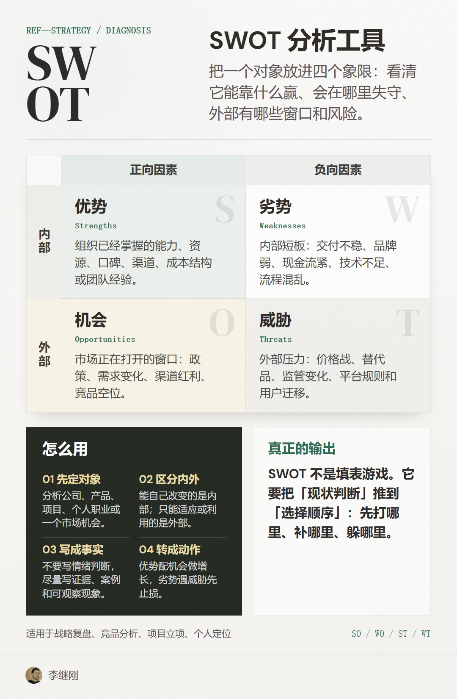

# cards-skill

`cards` 是一个 Codex skill，用来把方法、模型、框架和行业分析生成可分享的 HTML + PNG 信息图。

默认使用大卡逻辑：`1280px` 宽画布、完整长图输出，优先保证结构清楚、信息装得下、图表和表格不拥挤。只有明确要求紧凑版时，才会做小图。

## 能做什么

- 方法介绍：SWOT、STEEP、微笑曲线、商业模式画布等。
- 行业应用：把某个方法用于具体行业、市场、公司、产品或场景。
- 分析图：框架图、矩阵图、价值链图、竞争结构图、策略判断图。

## 使用方式

把 `skill/cards` 复制到 Codex skills 目录：

```text
~/.codex/skills/cards
```

然后在 Codex 里直接说：

```text
用 cards 做一张 SWOT 分析工具介绍图
用 cards 做一张 微笑曲线分析无人车行业
用 cards 分析一下商业模式画布
```

默认渲染命令：

```bash
node assets/capture.js <html> <png> 1280 900 fullpage
```

## 示例效果

### 商业模式画布



### 无人车行业微笑曲线



### AI 行业微笑曲线


### 代运营行业波特五力



### SWOT 分析工具



## 项目结构

```text
skill/cards/
  SKILL.md
  assets/
  references/
  agents/
examples/
  *.html
  *.png
```
